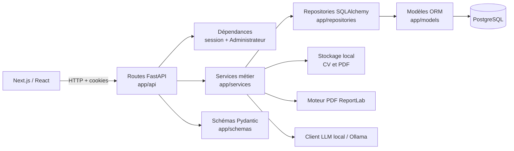
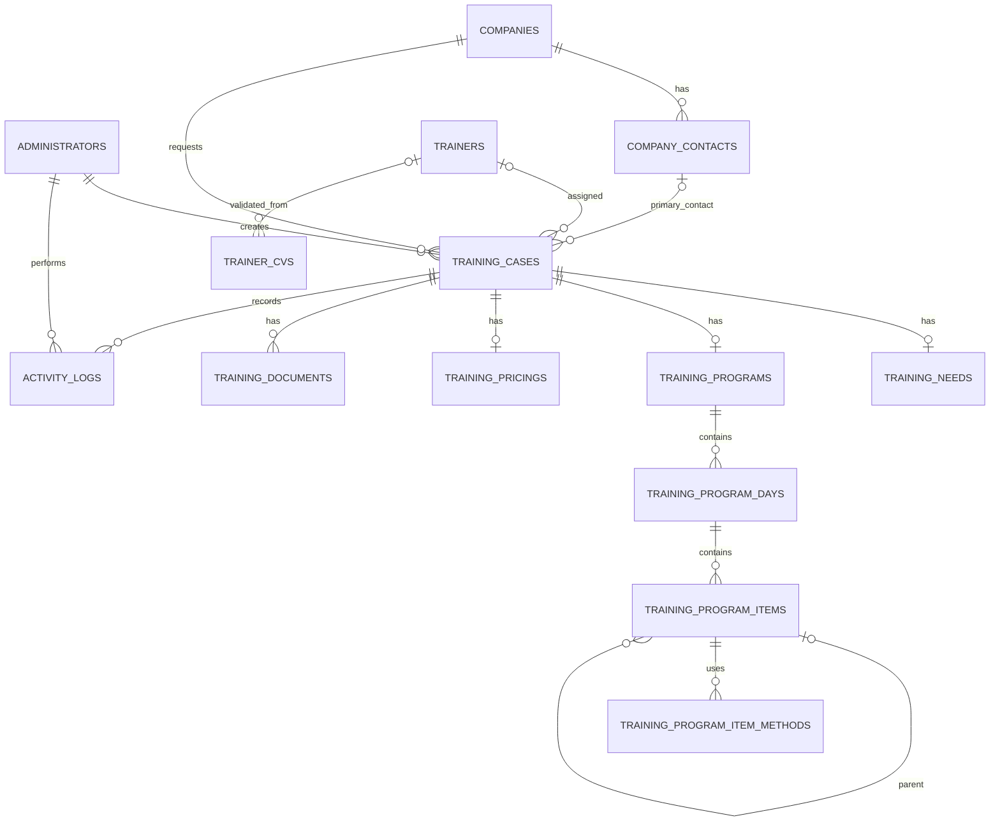

# État complet de l’application PrestaCode

> Audit technique et fonctionnel réalisé le 28 juillet 2026 sur le contenu réel de
> `C:\Users\User\Desktop\PrestaCode`.
>
> Ce document distingue strictement ce qui est implémenté, partiellement implémenté,
> prévu mais non implémenté, et absent. Les valeurs des secrets et des variables
> d’environnement ne sont volontairement jamais reproduites.

## 1. Synthèse

### 1.1 Présentation générale

| Élément | Constat |
|---|---|
| Nom observé | **PrestaCode**, décrit dans le code comme « Gestion des formations professionnelles » |
| Version backend | `0.1.0` |
| Objectif | Centraliser le cycle administratif d’une formation B2B, du dossier client aux documents PDF |
| Utilisateur principal | **Administrateur** |
| Problème traité | Dispersion des données client, formateur, besoin, programme, prix et documents |
| Architecture | Monorepo : API FastAPI/Python, interface Next.js/React/TypeScript, PostgreSQL, stockage local |
| État global | Parcours principal largement implémenté jusqu’à la génération et au téléchargement des documents |
| Extensions absentes | E-mail, n8n, RAG, signature électronique, facturation, gestion multi-rôles |

L’application permet actuellement à un Administrateur authentifié de gérer des
entreprises, contacts, formateurs et dossiers de formation. Un dossier suit un
workflow contrôlé : affectation d’un formateur, formalisation et validation du
besoin, création ou génération IA du programme, validation du prix, génération
de cinq PDF, puis clôture et archivage.

### 1.2 Verdict

Le socle fonctionnel des phases 0 à 5 est réel et couvert par des tests. L’import
et l’analyse structurée des CV sont également présents. Le terme « OCR » serait
toutefois inexact : le code extrait la couche texte des PDF et le XML des DOCX,
mais n’effectue aucune reconnaissance optique sur une image ou un PDF scanné.

Le projet passe ses tests, son lint et son build. Il ne satisfait pas encore le
contrôle statique Mypy. L’état de la base locale n’a pas pu être vérifié, car
PostgreSQL refuse les identifiants configurés. Docker Desktop était arrêté.

## 2. Périmètre et méthode

L’audit a porté sur les 176 fichiers applicatifs recensés hors dépendances et
artefacts de build :

- racine, scripts Windows, Docker Compose, Dockerfiles et fichiers de configuration ;
- API, services, repositories, modèles SQLAlchemy et schémas Pydantic ;
- dix migrations Alembic ;
- stockage des CV, génération et stockage des PDF ;
- client IA local et validation des sorties structurées ;
- pages Next.js, composants React, appels API, types et schémas Zod ;
- tests backend et frontend ;
- README et variables d’environnement.

Le dépôt ne possède pas l’arborescence hexagonale
`domain/application/infrastructure/interfaces/shared` citée dans l’ancienne
demande. L’architecture réellement présente est décrite en section 6.

## 3. Processus métier cible et état réel

| Étape cible | État réel | Justification |
|---|---|---|
| Création du dossier | **Implémentée** | CRUD, filtres, référence annuelle, historique et tests |
| Saisie du client et du besoin | **Implémentée** | Entreprise/contact et besoin brouillon/validé |
| Choix ou import du formateur | **Implémentée** | Création manuelle, import CV et affectation |
| Vérification du profil | **Partiellement implémentée** | Extraction structurée et validation humaine existent, sans OCR d’image ni matching automatique |
| Accord de principe | **Partiellement implémentée** | Statuts `FORMATEUR_PROPOSE` et `FORMATEUR_ACCEPTE`, sans document ni échange externe |
| Création du programme | **Implémentée** | Éditeur structuré, soumission/retour/validation et brouillon IA |
| Calcul du prix | **Implémentée** | Coûts, marge, TVA, snapshots et validation |
| Acceptation finale | **Partiellement implémentée** | Validation interne du prix, sans acceptation ou signature externe du client |
| Génération des documents | **Implémentée** | Cinq PDF, génération unitaire/groupée, empreinte et téléchargement |
| Envoi et clôture | **Partiellement implémentée** | Clôture et archivage présents ; bouton e-mail désactivé et aucun backend d’envoi |

## 4. Matrice des fonctionnalités

| Domaine | Fonctionnalité | Backend | Frontend | Tests | Statut | Preuve |
|---|---|---:|---:|---:|---|---|
| Authentification | Connexion par email/mot de passe | Oui | Oui | Oui | **Implémenté** | `app/api/auth.py`, `services/auth.py`, page `connexion`, `test_auth.py`, `login.test.tsx` |
| Session | Cookies JWT access/refresh, rotation, déconnexion | Oui | Oui | Oui | **Implémenté** | `core/security.py`, `api/auth.py`, `lib/api.ts` |
| Utilisateurs | Compte Administrateur actif/inactif | Oui | Lecture de l’utilisateur | Oui | **Partiel** | `models/administrator.py`, `/api/auth/me`; aucun CRUD utilisateur |
| Rôles | Rôles et permissions différenciés | Non | Non | Non | **Absent** | Aucun modèle, champ ou garde de rôle |
| Centre de formation | Paramétrage de l’organisme | Non | Non | Non | **Absent** | Aucune entité ni page dédiée |
| Audit | Journal des actions par dossier | Oui | Oui | Oui | **Partiel** | `ActivityLog`, route `/activity`; pas d’audit global ni de toutes les actions d’authentification |
| Entreprises | CRUD logique, recherche, filtres, archivage | Oui | Oui | Oui | **Implémenté** | `api/companies.py`, pages `entreprises`, tests companies |
| Contacts | Création, modification, suppression, contact principal | Oui | Oui | Oui | **Implémenté** | `CompanyContact`, `ContactRepository`, page détail entreprise |
| Demandes | Dossiers de formation | Oui | Oui | Oui | **Implémenté** | `training_cases.py`, pages `dossiers`, tests associés |
| Références | Référence annuelle unique | Oui | Affichage | Oui | **Implémenté** | `TrainingCaseCounter`, `TrainingCaseRepository.next_reference()` |
| Assignation | Affecter/retirer un formateur | Oui | Oui | Oui | **Implémenté** | `/training-cases/{id}/trainer`, `assignTrainer()` |
| Statuts | Machine d’état et transitions contrôlées | Oui | Oui | Oui | **Implémenté** | `TrainingCaseStatus`, `ALLOWED_TRANSITIONS`, `status.ts` |
| Dashboard | Compteurs et cinq dossiers récents | Oui | Oui | Oui | **Implémenté** | `/api/dashboard`, page `tableau-de-bord` |
| Formateurs | CRUD et archivage logique | Oui | Oui | Oui | **Implémenté** | `api/trainers.py`, pages `formateurs`, tests |
| Import CV | PDF/DOCX, limites, hash, doublons, stockage | Oui | Oui | Oui | **Implémenté** | `storage/cv.py`, `CVService`, page `import-cv` |
| OCR | Reconnaissance optique image/PDF scanné | Non | Non | Non | **Absent** | `CVTextExtractor` utilise `pypdf`/XML DOCX, aucune bibliothèque OCR |
| Extraction structurée | Texte vers profil structuré avec LLM et repli conservateur | Oui | Oui | Oui | **Implémenté** | `trainer_cv_extractor.py`, `cv_extraction.py`, tests extraction |
| Vérification humaine | Correction puis validation du CV en formateur | Oui | Oui | Oui | **Implémenté** | `/trainer-cvs/{id}/validate`, formulaire d’import |
| Matching | Recommandation automatique formateur/dossier | Non | Non | Test d’absence | **Absent** | `test_route_requires_authentication_and_matching_is_absent` |
| Accord de principe | Transitions proposé/accepté | Oui | Oui | Oui | **Partiel** | Statuts présents, aucune matérialisation externe de l’accord |
| Programmes | Structure jours/modules/sous-modules | Oui | Oui | Oui | **Implémenté** | modèles/programmes, composant `training-program-section.tsx` |
| Prix | Calcul, marge, TVA, soumission et validation | Oui | Oui | Oui | **Implémenté** | `TrainingPricingService`, composant pricing |
| Documents | Programme, devis, convention, présence, attestation | Oui | Oui | Oui | **Implémenté** | `renderers.py`, `TrainingDocumentService`, tests |
| E-mail | Envoi de documents | Non | Bouton désactivé | Oui, état désactivé | **Prévu non implémenté** | texte « prochaine version » dans le composant documents |
| n8n | Automatisation externe | Non | Non | Non | **Absent** | Aucune occurrence applicative |
| RAG | Recherche augmentée | Non | Non | Non | **Absent** | Aucun index, embedding ou retrieval |
| IA | Extraction CV et génération de programme via LLM local | Oui | Oui | Oui | **Implémenté sous configuration** | `ai/local_llm.py`, services de génération/extraction |

## 5. État des phases

### Phase 0 — Fondation : implémentée avec réserves

- Terminé : monorepo, FastAPI, Next.js, PostgreSQL, Alembic, Docker, CORS,
  authentification et erreurs métier structurées.
- Partiel : un seul type d’utilisateur ; pas de RBAC ; état PostgreSQL local non vérifié.
- Tests : santé, CORS et authentification.
- Risques : secrets d’exemple permissifs dans les valeurs par défaut du code ;
  configuration Docker sensible aux valeurs du `.env` hôte.
- Dépendance suivante : fiabiliser configuration, typage et environnement d’exécution.

### Phase 1 — Entreprises, contacts et demandes : implémentée

- Terminé : entreprises, contacts, contact principal, dossiers, références, filtres,
  pagination, historique, annulation, clôture et archivage.
- Partiel : journal limité au contexte d’un dossier.
- Tests backend et frontend complets sur les parcours principaux.
- Risque : les suppressions de contact sont physiques, contrairement à l’archivage
  logique des entreprises et formateurs.

### Phase 2 — Formateurs et workflow associé : implémentée avec réserves

- Terminé : CRUD, archivage, affectation/désaffectation, transitions proposé/accepté.
- Partiel : accord uniquement matérialisé par un statut interne.
- Absent : matching/recommandation.
- Tests : CRUD, sécurité upload, affectation et validation humaine.

### Phase 3 — Programme : implémentée

- Terminé : programme unique par dossier, jours, modules/sous-modules, ordre,
  durées théorie/pratique, méthodes, soumission, retour, validation.
- Tests : règles d’éligibilité, structure, durée, immutabilité et journalisation.
- Risque : composant React volumineux et contrôle Mypy en échec dans le service.

### Phase 4 — Prix : implémentée

- Terminé : initialisation depuis les tarifs formateur et la durée du programme,
  coûts annexes, marge, TVA, exemptions, snapshots, soumission et validation.
- Tests : arrondis, TVA, retours, immutabilité et dépendances.
- Risque : les règles financières sont codées dans le service et non configurables.

### Phase 5 — Documents : implémentée

- Terminé : initialisation idempotente, cinq PDF, génération unitaire et groupée,
  relance après échec partiel, SHA-256, snapshot, stockage local et téléchargement.
- Partiel : modèles PDF codés en dur, aucune signature ou transmission.
- Tests : validité PDF, contenu du devis, échec partiel, clôture et lecture seule.
- Risques : stockage local non redondé ; absence de politique de rétention/sauvegarde.

### Phase 6 — OCR et CV : partiellement implémentée

- Terminé : upload PDF/DOCX, extraction de texte natif, nettoyage, extraction
  structurée IA, repli regex, reprise après échec et validation humaine.
- Absent : OCR d’images et de PDF scannés.
- Tests : extraction PDF/DOCX, erreurs, validation structurée et workflow.
- Dépendance : intégrer un véritable moteur OCR seulement dans une future phase autorisée.

### Phase 7 — IA : implémentée sous condition

- Terminé : client HTTP Ollama local, schémas structurés stricts, extraction CV et
  génération d’un programme brouillon éditable.
- Partiel : disponibilité dépendante des variables du modèle local ; aucun suivi
  de prompt/version autre que le nom du modèle stocké pour le CV.
- Tests : clients simulés ; test d’intégration réel ignoré par défaut.
- Risque : indisponibilité du serveur local et qualité variable des sorties.

### Phase 8 — RAG : absente

- Aucun composant d’embedding, base vectorielle, index, retrieval ou corpus.
- Aucun test.

### Phase 9 — E-mail et automatisation : prévue mais non implémentée

- Le frontend affiche un bouton d’e-mail volontairement désactivé.
- Aucun service SMTP/API mail, template d’e-mail, webhook ou workflow n8n.
- Clôture manuelle disponible, mais pas d’envoi automatique.

## 6. Architecture backend réelle

### 6.1 Couches

- `app/api` : contrôleurs HTTP, paramètres, dépendances d’authentification et
  modèles de réponse.
- `app/services` : règles métier et orchestration des transactions.
- `app/repositories` : requêtes et persistance SQLAlchemy.
- `app/models` : entités ORM et relations.
- `app/schemas` : validation Pydantic des entrées/sorties.
- `app/core` : configuration, JWT, hash Argon2 et erreurs API.
- `app/db` : moteur, sessions et données de démonstration.
- `app/storage` : stockage sécurisé des fichiers.
- `app/documents` : rendu PDF ReportLab.
- `app/ai` : client Ollama, prompts et schémas des réponses structurées.

Il n’existe pas de couche `domain` indépendante de SQLAlchemy, ni de véritables
« use cases » séparés : les services jouent ce rôle. Il n’existe pas non plus de
conteneur d’injection ; FastAPI injecte la session et l’Administrateur, tandis que
les services construisent généralement leurs repositories eux-mêmes.

### 6.2 Transactions et erreurs

La session est créée par requête via `get_db()`. Les services appellent directement
`commit()`, et parfois `rollback()` autour des opérations multi-étapes. Les
repositories ajoutent, suppriment et `flush()` sans décider du commit.

Les erreurs métier utilisent `ApiError(status_code, code, message, details)` et un
handler global JSON. Les erreurs de validation natives FastAPI conservent toutefois
leur format standard, ce qui crée deux formats d’erreur possibles.

### 6.3 Sécurité et permissions

- mots de passe hashés avec l’algorithme recommandé par `pwdlib` (Argon2 installé) ;
- JWT signés avec type `access` ou `refresh`, dates d’émission et d’expiration ;
- cookies `HttpOnly`, `SameSite=Lax`, `Secure` configurable ;
- vérification de l’existence et de l’activité de l’Administrateur ;
- CORS limité à l’URL frontend configurée et credentials autorisés ;
- validation des extensions, signatures, taille, hash et chemins des CV ;
- confinement des chemins de documents dans le répertoire configuré.

Limites :

- aucun rôle ni permission granulaire ;
- aucun mécanisme explicite de révocation serveur des refresh tokens ;
- aucun verrouillage/rate limiting de connexion ;
- aucune protection CSRF dédiée au-delà de `SameSite=Lax` ;
- les routes frontend `/formateurs` ne figurent pas dans le matcher du proxy,
  même si les API correspondantes restent protégées côté backend.

## 7. Base de données

Les dix migrations forment une chaîne linéaire unique, de
`20260724_0001` à `20260725_0010`.

### 7.1 Tables réelles

| Table | Rôle et relations principales |
|---|---|
| `administrators` | comptes authentifiés |
| `companies` | entreprises clientes, archivage logique |
| `company_contacts` | contacts rattachés à une entreprise |
| `trainers` | formateurs et tarifs |
| `trainer_cvs` | métadonnées, hash et résultat d’extraction des CV |
| `training_case_counters` | compteur annuel des références |
| `training_cases` | dossier relié à entreprise, contact, formateur et créateur |
| `activity_logs` | événements reliés facultativement au dossier et à l’Administrateur |
| `training_needs` | besoin unique par dossier |
| `training_programs` | programme unique par dossier |
| `training_program_days` | journées ordonnées |
| `training_program_items` | modules/sous-modules auto-référencés |
| `training_program_item_methods` | association des méthodes pédagogiques |
| `training_pricings` | prix unique par dossier et snapshots |
| `training_documents` | cinq documents, métadonnées, snapshot et état |

Le schéma compte donc **15 tables**. Les UUID sont utilisés comme identifiants,
à l’exception du compteur annuel. Les statuts sont stockés comme chaînes et non
comme types ENUM PostgreSQL. Les relations critiques disposent de clés étrangères
et plusieurs ressources sont contraintes à l’unicité par dossier.

## 8. Routes API disponibles

L’OpenAPI généré expose **68 opérations**. À l’exception de la santé, de la
connexion, du refresh et du logout, les opérations métier utilisent la dépendance
`CurrentAdministrator`.

### 8.1 Système et authentification

| Méthode | Route | Fonction |
|---|---|---|
| GET | `/health` | Santé API |
| POST | `/api/auth/login` | Connexion et cookies |
| GET | `/api/auth/me` | Administrateur courant |
| POST | `/api/auth/refresh` | Rotation des jetons |
| POST | `/api/auth/logout` | Suppression des cookies |

### 8.2 Entreprises et contacts

| Méthode | Route | Fonction |
|---|---|---|
| GET, POST | `/api/companies` | Liste filtrée / création |
| GET, PATCH, DELETE | `/api/companies/{company_id}` | Lecture / modification / archivage |
| GET, POST | `/api/companies/{company_id}/contacts` | Liste / création de contact |
| PATCH, DELETE | `/api/contacts/{contact_id}` | Modification / suppression |

### 8.3 Dossiers et dashboard

| Méthode | Route | Fonction |
|---|---|---|
| GET, POST | `/api/training-cases` | Liste filtrée / création |
| GET, PATCH | `/api/training-cases/{case_id}` | Lecture / modification |
| POST | `/api/training-cases/{case_id}/change-status` | Transition manuelle autorisée |
| POST | `/api/training-cases/{case_id}/cancel` | Annulation |
| POST | `/api/training-cases/{case_id}/close` | Clôture |
| POST | `/api/training-cases/{case_id}/archive` | Archivage |
| GET | `/api/training-cases/{case_id}/activity` | Historique |
| GET | `/api/dashboard` | Indicateurs et dossiers récents |

### 8.4 Formateurs et CV

| Méthode | Route | Fonction |
|---|---|---|
| GET, POST | `/api/trainers` | Liste / création |
| GET, PATCH, DELETE | `/api/trainers/{trainer_id}` | Lecture / modification / archivage |
| GET | `/api/trainer-cvs` | Liste des CV |
| POST | `/api/trainer-cvs/upload` | Import |
| GET, DELETE | `/api/trainer-cvs/{cv_id}` | Lecture / suppression |
| POST | `/api/trainer-cvs/{cv_id}/extract` | Extraction structurée |
| POST | `/api/trainer-cvs/{cv_id}/validate` | Validation humaine et création formateur |
| POST | `/api/training-cases/{case_id}/trainer` | Affectation ou retrait |

### 8.5 Besoin

| Méthode | Route | Fonction |
|---|---|---|
| GET, POST, PATCH | `/api/training-cases/{case_id}/need` | Lecture / création / modification |
| POST | `/api/training-cases/{case_id}/need/validate` | Validation |

### 8.6 Programme

| Méthode | Route | Fonction |
|---|---|---|
| GET, POST, PATCH | `/api/training-cases/{case_id}/program` | Lecture / création / modification |
| POST | `/api/training-cases/{case_id}/program/generate-draft` | Génération IA |
| POST | `/api/training-cases/{case_id}/program/submit` | Soumission |
| POST | `/api/training-cases/{case_id}/program/return` | Retour en préparation |
| POST | `/api/training-cases/{case_id}/program/validate` | Validation |
| POST | `/api/training-cases/{case_id}/program/days` | Ajout journée |
| PATCH, DELETE | `/api/training-cases/{case_id}/program/days/{day_id}` | Modification / suppression |
| POST | `/api/training-cases/{case_id}/program/days/{day_id}/move-up` | Monter journée |
| POST | `/api/training-cases/{case_id}/program/days/{day_id}/move-down` | Descendre journée |
| POST | `/api/training-cases/{case_id}/program/days/{day_id}/items` | Ajout élément |
| PATCH, DELETE | `/api/training-cases/{case_id}/program/items/{item_id}` | Modification / suppression |
| POST | `/api/training-cases/{case_id}/program/items/{item_id}/move-up` | Monter élément |
| POST | `/api/training-cases/{case_id}/program/items/{item_id}/move-down` | Descendre élément |

### 8.7 Tarification

| Méthode | Route | Fonction |
|---|---|---|
| GET, POST, PATCH | `/api/training-cases/{case_id}/pricing` | Lecture / initialisation / modification |
| POST | `/api/training-cases/{case_id}/pricing/submit` | Soumission |
| POST | `/api/training-cases/{case_id}/pricing/return` | Retour |
| POST | `/api/training-cases/{case_id}/pricing/validate` | Validation |

### 8.8 Documents

| Méthode | Route | Fonction |
|---|---|---|
| GET | `/api/training-cases/{case_id}/documents` | Liste |
| POST | `/api/training-cases/{case_id}/documents/initialize` | Initialisation des cinq documents |
| POST | `/api/training-cases/{case_id}/documents/generate-all` | Génération groupée |
| POST | `/api/training-cases/{case_id}/documents/{document_type}/generate` | Génération unitaire |
| GET | `/api/training-cases/{case_id}/documents/{document_type}/download` | Téléchargement |

## 9. Frontend

### 9.1 Architecture

Le frontend utilise l’App Router Next.js. Les pages orchestrent React Query,
les composants portent les formulaires métier, `features/*/api.ts` regroupe les
appels HTTP et `types` décrit les contrats TypeScript. `apiRequest()` ajoute les
credentials, transforme les erreurs et tente une seule rotation du refresh token
après un `401`.

Les schémas Zod existent pour la connexion, les entreprises, les contacts et les
dossiers. Les formulaires plus complexes de besoin, programme, prix et formateur
effectuent surtout leurs validations dans les composants ou côté serveur ; il
n’existe donc pas un schéma Zod central pour chaque contrat API.

### 9.2 Pages réelles

| Route | Type build | Fonction |
|---|---|---|
| `/` | statique | accueil et contrôle manuel de santé du backend |
| `/connexion` | statique | authentification |
| `/tableau-de-bord` | statique | indicateurs et dossiers récents |
| `/entreprises` | statique | recherche et liste |
| `/entreprises/nouvelle` | statique | création |
| `/entreprises/[id]` | dynamique | détail, modification et contacts |
| `/dossiers` | statique | liste et filtres |
| `/dossiers/nouveau` | statique | création |
| `/dossiers/[id]` | dynamique | dossier et toutes les sections du workflow |
| `/formateurs` | statique | liste, recherche et création |
| `/formateurs/[id]` | dynamique | détail et modification |
| `/formateurs/import-cv` | statique | import, extraction, correction et validation |

Le build affiche aussi la route technique `/_not-found`. Le proxy protège
`tableau-de-bord`, `entreprises` et `dossiers`, mais pas `formateurs`.

## 10. Workflows réellement fonctionnels

Sous réserve d’une base migrée et des variables correctement configurées :

1. connexion → rotation automatique de session → déconnexion ;
2. création/recherche/archivage d’entreprise → gestion des contacts ;
3. création d’un dossier → référence annuelle → mise à jour et historique ;
4. création manuelle d’un formateur → affectation → proposition → acceptation ;
5. import CV → extraction texte → extraction structurée IA/repli → correction
   humaine → création du formateur ;
6. besoin brouillon → validation → passage à `BESOIN_COMPLETE` ;
7. programme manuel ou brouillon IA → structuration → soumission → retour ou validation ;
8. initialisation tarifaire → calculs → soumission → retour ou validation ;
9. initialisation des cinq documents → génération → téléchargement → clôture ;
10. annulation, clôture puis archivage selon les règles de statut.

Ne sont pas fonctionnels : matching automatique, OCR de scans, acceptation client
externe, envoi e-mail, signature, facture, n8n et RAG.

## 11. Tests

### 11.1 Backend

Les tests utilisent FastAPI `TestClient` et une base SQLite temporaire via
remplacement de dépendance. Ils couvrent :

- santé/CORS et authentification ;
- entreprises et contacts ;
- dossiers, références, filtres, transitions et activité ;
- formateurs, CV, sécurité des fichiers et affectation ;
- extraction textuelle/structurée et erreurs ;
- besoin, programme manuel/IA, prix et documents.

Résultat : **81 réussis, 1 ignoré**. Le test ignoré est l’intégration avec le modèle
LLM local privé, marquée `local_llm`.

### 11.2 Frontend

Vitest, Testing Library et jsdom couvrent 12 fichiers : connexion, dashboard,
entreprises, détail entreprise, dossiers, formateurs, import CV, besoin, génération
IA, programme, prix et documents.

Résultat : **12 fichiers réussis, 32 tests réussis, aucun ignoré**.

Limites de la stratégie :

- la majorité des tests backend tourne sur SQLite et non PostgreSQL ;
- pas de test end-to-end navigateur avec backend et PostgreSQL réels ;
- pas de test Docker ;
- intégration LLM réelle ignorée par défaut ;
- pas de couverture chiffrée.

## 12. Commandes de validation exécutées

| Commande | Résultat |
|---|---|
| `python -m compileall app tests scripts` | Code `0`; `app` compilé. Avertissements : dossiers backend `tests` et `scripts` inexistants |
| `pytest -q` | Code `0`; **81 passed, 1 skipped** |
| `ruff check .` | Code `0`; tous les contrôles réussis |
| `mypy app` | Code `1`; **67 erreurs dans 16 fichiers** |
| `python -m alembic current` | Échec : authentification PostgreSQL refusée ; aucune révision courante vérifiée |
| `python -m alembic history` | Code `0`; chaîne linéaire de 10 migrations |
| `python -m alembic heads` | Code `0`; une tête : `20260725_0010` |
| `python -m alembic upgrade head` | Échec avant migration : authentification PostgreSQL refusée |
| `npm run lint` | Code `0` |
| `npm run test -- --run` | Code `0`; **12 fichiers, 32 tests** |
| `npm run build` | Code `0`; compilation et vérification TypeScript réussies |
| `docker compose config` | Code `0`; configuration syntaxiquement valide |
| `docker compose ps` | Échec environnemental : Docker Desktop non démarré |

L’échec Docker n’est pas une erreur du code. L’échec PostgreSQL indique un
désalignement de configuration ou d’état local ; aucune valeur sensible n’est
reproduite ici.

## 13. Variables d’environnement

| Nom | Rôle |
|---|---|
| `POSTGRES_DB` | nom de la base du conteneur PostgreSQL |
| `POSTGRES_USER` | utilisateur PostgreSQL |
| `POSTGRES_PASSWORD` | mot de passe PostgreSQL |
| `DATABASE_URL` | URL SQLAlchemy de connexion |
| `JWT_SECRET` | clé de signature des JWT |
| `JWT_ALGORITHM` | algorithme JWT |
| `ACCESS_TOKEN_EXPIRE_MINUTES` | durée du jeton d’accès |
| `REFRESH_TOKEN_EXPIRE_DAYS` | durée du jeton de renouvellement |
| `FRONTEND_URL` | origine CORS |
| `BACKEND_URL` | URL publique backend |
| `NEXT_PUBLIC_API_URL` | URL API exposée au navigateur |
| `AUTH_COOKIE_SECURE` | émission des cookies uniquement sur HTTPS |
| `CV_STORAGE_DIR` | stockage local des CV |
| `MAX_CV_FILE_SIZE_MB` | taille maximale d’un CV |
| `DOCUMENT_STORAGE_PATH` | stockage local des PDF |
| `DOCUMENT_MAX_SIZE_MB` | taille maximale d’un PDF |
| `LOCAL_LLM_URL` | endpoint du modèle local |
| `LOCAL_LLM_MODEL` | modèle local sélectionné |
| `LOCAL_LLM_TIMEOUT_SECONDS` | timeout extraction CV |
| `PROGRAM_GENERATION_TIMEOUT_SECONDS` | timeout génération programme |
| `LOCAL_LLM_MAX_TOKENS` | limite de génération |
| `LOCAL_LLM_TEMPERATURE` | température du modèle |

## 14. Problèmes, limites et risques

### Priorité haute

1. **Base locale non validable** : les identifiants configurés ne permettent pas
   à Alembic de se connecter. Le parcours réel complet n’est donc pas prouvé dans
   l’environnement audité.
2. **Typage backend en échec** : 67 erreurs Mypy, dont plusieurs accès à des
   relations potentiellement `None` dans la génération documentaire.
3. **Configuration Docker potentiellement incohérente** : si `DATABASE_URL` du
   `.env` cible `localhost`, le backend conteneur cherchera PostgreSQL dans son
   propre conteneur au lieu du service `postgres`.
4. **Gestion Git anormale** : aucun dépôt Git autonome n’est détecté à la racine
   de PrestaCode ; Git remonte jusqu’au profil utilisateur Windows. Cela présente
   un risque majeur de suivi accidentel de fichiers personnels et sensibles.

### Priorité moyenne

5. Le proxy Next.js omet les routes `/formateurs`.
6. Aucun RBAC : tous les Administrateurs actifs disposent des mêmes droits.
7. Pas de révocation serveur, rate limiting ni verrouillage après échecs de connexion.
8. Les valeurs par défaut de configuration conviennent au développement, pas à
   une production sans validation stricte.
9. Les tests n’exercent pas PostgreSQL, Docker ni le parcours end-to-end réel.
10. Le stockage local des CV/PDF n’offre ni redondance ni sauvegarde applicative.
11. L’audit n’est pas global et ne couvre pas uniformément toutes les opérations.

### Limites fonctionnelles assumées

12. Pas d’OCR de scans, matching, e-mail, n8n, RAG, signature ou facturation.
13. Accord formateur et acceptation client réduits à des transitions internes.
14. Les informations du centre de formation ne sont pas administrables.

## 15. Prochaine étape recommandée

Sans commencer une nouvelle phase fonctionnelle, la prochaine étape recommandée
est une **phase de stabilisation et de reproductibilité** :

1. isoler correctement le projet dans son propre dépôt Git et vérifier les règles
   d’exclusion des fichiers sensibles ;
2. réaligner la configuration PostgreSQL locale, exécuter `alembic current` puis
   `alembic upgrade head` sur une base dédiée ;
3. démarrer Docker et valider le trio PostgreSQL/backend/frontend sans exposer de
   secrets dans les journaux ;
4. corriger les 67 erreurs Mypy, en priorité celles concernant les relations
   optionnelles utilisées par les documents ;
5. ajouter un test d’intégration PostgreSQL et un test end-to-end du parcours
   dossier → documents → clôture ;
6. compléter la protection frontend de `/formateurs` et formaliser les exigences
   de sécurité avant tout déploiement.

Une fois ces points validés, le projet disposera d’une base fiable pour décider
explicitement de la prochaine phase métier, sans présenter comme existants l’OCR,
le RAG, l’e-mail ou l’automatisation.
